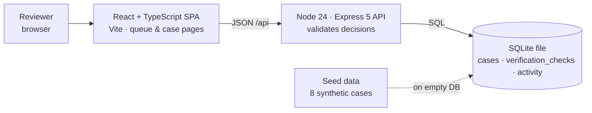

# KYC Review Queue

Prototype of an internal KYC review queue for a fictional fintech's compliance team.
Built to evaluate whether this kind of internal tool can be built and maintained as a
plain web app instead of a Power Apps application.

**All data is synthetic.** Names, documents, addresses and check results are invented.

## Stack

| Layer     | Choice                                                                        |
| --------- | ----------------------------------------------------------------------------- |
| Frontend  | React 19 + TypeScript, Vite, React Router                                     |
| API       | Node.js (>= 22.13) + Express 5, TypeScript run directly via Node type-stripping |
| Database  | SQLite via Node's built-in `node:sqlite` module (no native build step)         |
| Tests     | `node:test` (built-in test runner)                                            |
| Lint/type | ESLint (typescript-eslint, react-hooks) + `tsc --noEmit`                      |

There is nothing to compile for the server and no external database to run.

## Architecture



In development Vite (`:5173`) serves the SPA and proxies `/api` to Express (`:3001`);
in production Express also serves the built client from `client/dist`.

## Quick start

Requires **Node.js 22.13 or newer** (`node --version`). Node 24 is recommended.

```bash
npm install
npm run dev
```

Then open <http://localhost:5173>.

- `npm run dev` starts the API on port 3001 and the Vite dev server on port 5173
  (which proxies `/api/*` to the API).
- On first start the API creates `server/data/kyc.sqlite`, applies the schema and
  seeds 8 synthetic cases. Subsequent starts reuse the existing database, so decisions
  and history survive restarts.

### Production-style run (single port)

```bash
npm install
npm run build      # builds client/dist
npm start          # API on http://localhost:3001 also serves the built UI
```

### Other commands

```bash
npm test           # run the API/decision/history tests (node:test)
npm run lint       # eslint
npm run typecheck  # tsc for server and client
npm run seed       # wipe and reseed the database with the synthetic cases
```

Environment variables (optional): `PORT` (API port, default `3001`),
`KYC_DB_PATH` (SQLite file, default `server/data/kyc.sqlite`).

## What it does

1. **Queue** (`/`): applicant name, submission date, status, assigned reviewer and the
   reason the case was routed for manual review. Filter by status (Pending, Info requested,
   Approved, Escalated, All) and search by applicant name or case ID. Flagged cases show a
   red flag marker and a risk badge.
2. **Case detail** (`/cases/:id`): submitted applicant details, simulated verification
   checks (pass / review / fail with a detail line), the decision form and the activity
   history.
3. **Decisions**: a reviewer can *approve*, *request more information* or *escalate* an
   open case (`pending` or `info_requested`). A written reason (min 10 characters) is
   mandatory; the submit button stays disabled until it is provided and the API validates
   it again. On success the case status, the queue and the history update immediately.
4. **Activity history**: every case has a chronological log of `submitted`, `assigned`,
   `flagged` and decision events with action, reason, reviewer and timestamp. Decisions
   are written to the history in the same SQLite transaction as the status change.
5. **Final decisions are locked**: `approved` and `escalated` are final. The UI replaces the
   decision form with a notice, and the API returns `409 Conflict` for any further decision
   on that case, so a double-click or stale tab cannot approve or escalate it again.
   `info_requested` is intentionally *not* final: the case stays open for a follow-up
   decision once the applicant responds.

The "Acting as" selector in the header chooses which reviewer decisions are recorded
under (there is no authentication in this prototype).

### Seed data

| Case     | Applicant            | Status         | Why it is in the queue                                    |
| -------- | -------------------- | -------------- | --------------------------------------------------------- |
| KYC-1041 | Amelia Hartley       | pending        | Ordinary case: random QA sample, all checks pass          |
| KYC-1042 | Viktor Sokolov       | pending        | **Flagged**: sanctions fuzzy match, address check failed  |
| KYC-1043 | Chidera Nwosu        | info_requested | Document expires within 30 days                           |
| KYC-1044 | Marta Kowalczyk      | approved       | Selfie match below auto-approve threshold (already decided) |
| KYC-1045 | Daniel Okonkwo-Reyes | escalated      | Confirmed PEP (already escalated)                         |
| KYC-1046 | Sofia Andersson      | pending        | Third onboarding attempt in 30 days                       |
| KYC-1047 | Rahul Mehta          | pending        | Declared income inconsistent with occupation              |
| KYC-1048 | Grace O'Sullivan     | pending        | Large initial deposit, source of funds required           |

## API

| Method | Path                       | Description                                                       |
| ------ | -------------------------- | ----------------------------------------------------------------- |
| GET    | `/api/health`              | Liveness + case count                                             |
| GET    | `/api/meta`                | Statuses, decision actions and reviewer list                      |
| GET    | `/api/cases?status=&q=`    | Queue. `status` = `all` or a status; `q` matches applicant or ID  |
| GET    | `/api/cases/:id`           | Case detail incl. `applicant`, `checks`, `history`                |
| POST   | `/api/cases/:id/decisions` | Body `{ action, reason, reviewer }`. `201` with updated case; `400` invalid; `404` unknown; `409` final |

## Tests

`npm test` runs 11 tests in `server/test/decisions.test.ts`:

- repository level: approve records history with action/reason/reviewer/timestamp;
  history stays chronological across multiple decisions; `request_info` keeps a case open;
  final cases reject further decisions (409) without touching history; invalid input is
  rejected without changing state; unknown case -> 404
- persistence: a decision survives closing and reopening the SQLite file, and reopening
  does not reseed
- HTTP: queue filter/search, case detail, 400/201/409 responses through Express

## Project layout

```
client/            React + Vite frontend
  src/pages/       QueuePage, CasePage
  src/api.ts       typed fetch wrapper
server/            Express API
  src/db.ts        schema, CaseRepository, decision validation
  src/seed.ts      synthetic seed data (also `npm run seed`)
  src/app.ts       routes + error handling
  src/index.ts     entrypoint
  test/            node:test suite
powerapps/         Power Apps canvas app + Dataverse version (see below)
```

## Power Apps version (part B)

The same workflow is also built as a **Power Apps canvas app backed by Dataverse**,
so the two stacks can be compared side by side. Everything lives under `powerapps/`
and is reviewable as source; nothing is hand-edited in the maker portal that is not
also in this repo.

### Open it in the maker portal

The app is deployed to the provisioned environment `https://org64ad231d.crm11.dynamics.com`
(environment id `b76846b4-0c24-e4d8-952c-46ffa09ad6a8`, UK region).

1. Sign in to <https://make.powerapps.com> with an account that has access to that
   environment and pick it in the environment switcher (top right).
2. **Solutions → KYC Review Queue** (unique name `KYCReviewQueue`, publisher prefix `kyc`).
   The solution contains the three tables and the canvas app.
3. Open the canvas app **KYC Review Queue** (`kyc_kycreviewqueue_7c2e1`) with **Edit** to
   load it in Power Apps Studio, or **Play** to run it. Direct links:
   - Edit: <https://make.powerapps.com/environments/b76846b4-0c24-e4d8-952c-46ffa09ad6a8/apps/92f459e2-451c-4b1b-8bd1-a8c51b9de363>
   - Play: <https://apps.powerapps.com/play/e/b76846b4-0c24-e4d8-952c-46ffa09ad6a8/a/92f459e2-451c-4b1b-8bd1-a8c51b9de363?tenantId=c6a3b549-494b-4711-b35d-2671b4f06cde>
4. **Tables → KYC Case / Verification Check / KYC Case Activity** show the seeded
   synthetic records (same 8 applicants as the SQLite seed, `KYC-1042` and `KYC-1045`
   flagged).

The app was built and imported headlessly with `pac`, so the first time Studio opens it,
it may ask to refresh the Dataverse data sources (the packed table metadata is minimal
and Studio fetches the live schema). Accept the refresh; no formulas need to change.

### What is in `powerapps/`

```
powerapps/
  canvas-app/          pac canvas unpack output (Experimental layout)
    Src/QueueScreen.fx.yaml    queue: status filter, name/reference search, gallery
    Src/DetailScreen.fx.yaml   detail: fields, simulated checks, history, decisions
    DataSources/               Dataverse tables the app binds to
    pkgs/                      Dataverse table metadata + first-party control templates
  solution/            pac solution unpack output (tables, relationships, app metadata)
  scripts/
    provision.ts       creates publisher, solution, tables, columns, relationships (Web API)
    seed.ts            seeds the synthetic cases, checks and history (reuses server/src/seed.ts)
    deploy.sh          pac canvas pack -> pac solution pack -> pac solution import
    unpack.sh          export from the environment and refresh canvas-app/ + solution/
```

Dataverse schema (publisher prefix `kyc`):

| Table | Purpose | Key columns |
|---|---|---|
| `kyc_case` (KYC Cases) | one applicant case | Case reference, Applicant name, Submitted at, Case status (Pending / Info requested / Approved / Escalated), Assigned reviewer, Review reason, Risk level, Flagged, Decided at |
| `kyc_verificationcheck` | simulated screening results | Check, Result (Pass / Warn / Fail), Detail, Order, Case (lookup) |
| `kyc_caseactivity` | chronological history | Summary, Action, Reason, Reviewer, Occurred at, Case (lookup) |

App behaviour mirrors part A: the queue screen filters by status and searches by
applicant name or case reference; the detail screen shows the applicant fields, the
simulated checks and the history in time order; **Approve**, **Request more
information** and **Escalate** all require a written reason of at least 10 characters
(`Patch` on `KYC Cases` plus a new `KYC Case Activities` row); approved and escalated
cases are final and the decision controls are disabled.

### Rebuilding / redeploying

Requires the [Power Platform CLI](https://learn.microsoft.com/power-platform/developer/cli/introduction)
(`pac`, tested with 2.12) and Node 22+.

```bash
export PP_ENV_URL=https://org64ad231d.crm11.dynamics.com
export PP_TENANT_ID=c6a3b549-494b-4711-b35d-2671b4f06cde
export PP_CLIENT_ID=... PP_CLIENT_SECRET=...        # service principal (application user)

npm run provision -w powerapps     # idempotent: publisher, solution, tables, relationships
npm run seed -w powerapps          # idempotent; add --reset to wipe and reseed
# after changing tables/columns: re-add the tables in Studio (Data pane), Save + Publish, then npm run unpack

pac auth create --url "$PP_ENV_URL" --applicationId "$PP_CLIENT_ID" \
  --clientSecret "$PP_CLIENT_SECRET" --tenant "$PP_TENANT_ID" --accept-cleartext-caching
npm run deploy -w powerapps        # pack canvas app + solution, import, publish
npm run unpack -w powerapps        # pull Studio edits back into source
```

Out of scope, as in part A: real identity verification, real PII, non-Dataverse
connectors and production polish.

## Known limitations

- No authentication or authorisation; the acting reviewer is chosen from a dropdown.
- Verification checks are static seed data, not calls to a real KYC provider.
- Single SQLite file; fine for a prototype, not for multi-instance deployment.
- No "reject" decision: the brief only asked for approve / request info / escalate.
